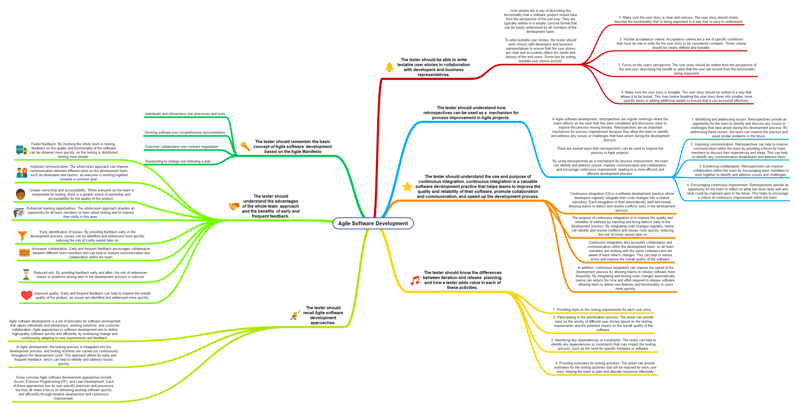
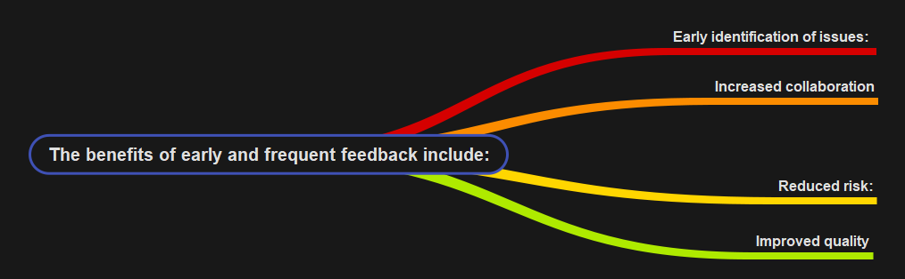

### <h1 align="center" style="color:blue;" id="heading">Agile-Software-Testing</h1>

<!-- PROJECT LOGO -->
<br />
<p align="center">
  <a href="https://github.com/saboye/Agile-Software-Testing">
    
  </a>

  

<!-- ### Table of contents
[PART -1](#part_1)
1. [what is an agile software development?](#what_is_agile_software_development)
2. [Agile Software Development](#Agile_Software_Development)<br>
    2.1. [The whole-team approach](#early_feedback)
3. [The tester should recall Agile software development approaches.](#recall) -->


[PART -2](#part_2)

[PART -3](#part_3)
  

### <h1 align="center" style="color:blue;" id="heading">PART -1 </h1><a name="part_1">

# What is an Agile Software Development? <a name="what_is_agile_software_development"></a>

<p align="justify">
Agile software development is a method of software development that emphasizes the rapid and flexible development of high-quality software. It is based on the Agile Manifesto, which outlines a set of values and principles for software development that prioritize the needs and expectations of the customer, and advocate for the use of iterative and incremental approaches to software development.</p>

<p align="justify">
Agile software development emphasizes collaboration, adaptability, and continuous delivery, and it is often characterized by the use of short development cycles, known as "sprints," in which small teams of developers work closely together to deliver incremental improvements to the software. Agile methods also place a strong emphasis on user feedback and testing, and on the ability to quickly respond to changing requirements and priorities.</p>

<p align="justify">
The goal of agile software development is to create software that is flexible, responsive, and able to adapt to changing needs and requirements. It is often used in environments where the requirements or needs of the software are not fully understood at the outset, or where there is a need to iteratively and incrementally improve the software over time.<p>

  <a href="https://github.com/saboye/Agile-Software-Testing/blob/main/images/agile_softwar_development.png">
    
  </a>
  
# Agile Software Development <a name="Agile_Software_Development">
## The whole-team approach to testing involves involving all members of the development team in the testing process, rather than relying solely on a dedicated testing team. This approach has several advantages: <a name ="#early_feedback">
  
1. Faster feedback: By involving the whole team in testing, feedback on the quality and functionality of the software can be obtained more quickly, as the testing is distributed among more people.

2. Improved communication: The whole-team approach can improve communication between different roles on the development team, such as developers and testers, as everyone is working together towards a common goal.

3. Greater ownership and accountability: When everyone on the team is responsible for testing, there is a greater sense of ownership and accountability for the quality of the product.

4. Enhanced learning opportunities: The whole-team approach provides an opportunity for all team members to learn about testing and to improve their skills in this area.
  
  <a href="https://github.com/saboye/Agile-Software-Testing">
    
  </a>
The benefits of early and frequent feedback include: <a name="early_feedback">

1. Early identification of issues: By providing feedback early in the development process, issues can be identified and addressed more quickly, reducing the risk of costly rework later on.

2. Increased collaboration: Early and frequent feedback encourages collaboration between different team members and can help to improve communication and collaboration within the team.

3. Reduced risk: By providing feedback early and often, the risk of unforeseen issues or problems arising later in the development process is reduced.

4. Improved quality: Early and frequent feedback can help to improve the overall quality of the product, as issues are identified and addressed more quickly.
  
    <a href="https://github.com/saboye/Agile-Software-Testing">
    
  </a>
  
## The tester should recall Agile software development approaches.<a name="recall">
  
Agile software development is a set of principles for software development that values individuals and interactions, working solutions, and customer collaboration. Agile approaches to software development aim to deliver high-quality software quickly and efficiently by embracing change and continuously adapting to new requirements and feedback.

In Agile development, the testing process is integrated into the development process, and testing activities are carried out continuously throughout the development cycle. This approach allows for early and frequent feedback, which can help to identify and address issues quickly.

Some common Agile software development approaches include Scrum, Extreme Programming (XP), and Lean Development. Each of these approaches has its own specific practices and processes, but they all share a focus on delivering working software quickly and efficiently through iterative development and continuous improvement.
  
## The tester should be able to write testable user stories in collaboration  with developers and business representatives.  
  
User stories are a way of describing the functionality that a software product should have from the perspective of the end user. They are typically written in a simple, concise format that can be easily understood by all members of the development team.

To write testable user stories, the tester should work closely with developers and business representatives to ensure that the user stories are clear and accurately reflect the needs and desires of the end users. Some tips for writing testable user stories include:

1. Make sure the user story is clear and concise: The user story should clearly describe the functionality that is being requested in a way that is easy to understand.

2. Include acceptance criteria: Acceptance criteria are a set of specific conditions that must be met in order for the user story to be considered complete. These criteria should be clearly defined and testable.

3. Focus on the user's perspective: The user story should be written from the perspective of the end user, describing the benefit or value that the user will receive from the functionality being requested.

4. Make sure the user story is testable: The user story should be written in a way that allows it to be tested. This may involve breaking the user story down into smaller, more specific tasks or adding additional details to ensure that it can be tested effectively.

By working closely with developers and business representatives and following these guidelines, the tester can write testable user stories that accurately reflect the needs and desires of the end users and can be easily tested.
  
## The tester should understand how retrospectives can be used as a  mechanism for process improvement in Agile projects.  
  
In Agile software development, retrospectives are regular meetings where the team reflects on the work that has been completed and discusses ways to improve the process moving forward. Retrospectives are an important mechanism for process improvement because they allow the team to identify and address any issues or challenges that have arisen during the development process.
```ruby
There are several ways that retrospectives can be used to improve the process in Agile projects :-
```
1. Identifying and addressing issues: Retrospectives provide an opportunity for the team to identify and discuss any issues or challenges that have arisen during the development process. By addressing these issues, the team can improve the process and avoid similar problems in the future.

2. Improving communication: Retrospectives can help to improve communication within the team by providing a forum for team members to discuss their experiences and ideas. This can help to identify any communication breakdowns and address them.

3. Enhancing collaboration: Retrospectives can improve collaboration within the team by encouraging team members to work together to identify and address issues and challenges.

4. Encouraging continuous improvement: Retrospectives provide an opportunity for the team to reflect on what has been done well and what could be improved upon in the future. This helps to encourage a culture of continuous improvement within the team.

By using retrospectives as a mechanism for process improvement, the team can identify and address issues, improve communication and collaboration, and encourage continuous improvement, leading to a more efficient and effective development process.
 
## The tester should understand the use and purpose of continuous  integration.  

Continuous integration (CI) is a software development practice where developers regularly integrate their code changes into a shared repository. Each integration is then automatically built and tested, allowing teams to detect and resolve conflicts early in the development process.

The purpose of continuous integration is to improve the quality and reliability of software by catching and fixing defects early in the development process. By integrating code changes regularly, teams can identify and resolve conflicts and issues more quickly, reducing the risk of costly rework later on.

Continuous integration also promotes collaboration and communication within the development team, as all team members are working with the same codebase and are aware of each other's changes. This can help to reduce errors and improve the overall quality of the software.

In addition, continuous integration can improve the speed of the development process by allowing teams to release software more frequently. By integrating and testing code changes automatically, teams can reduce the time and effort required to release software, allowing them to deliver new features and functionality to users more quickly.

Overall, continuous integration is a valuable software development practice that helps teams to improve the quality and reliability of their software, promote collaboration and communication, and speed up the development process.

## The tester should know the differences between iteration and release  planning, and how a tester adds value in each of these activities. 

Iteration planning and release planning are two important activities in the software development process that help teams to define and prioritize the work that needs to be done.

Iteration planning is the process of planning the work that will be completed during a specific iteration (also known as a sprint in Agile development). This typically involves identifying and prioritizing the user stories that will be worked on during the iteration, and breaking them down into smaller tasks that can be completed within the iteration timeframe.

Release planning is the process of planning the work that will be completed for a specific software release. This typically involves identifying and prioritizing the user stories that will be included in the release, and determining the overall scope and timeline for the release.
```ruby
A tester adds value to both iteration and release planning by:
```

1. Providing input on the testing requirements for each user story: The tester can help to identify any testing considerations or requirements for each user story, such as the types of tests that need to be performed or the data that needs to be prepared for testing.

2. Participating in the prioritization process: The tester can provide input on the priority of different user stories based on the testing requirements and the potential impact on the overall quality of the software.

3. Identifying any dependencies or constraints: The tester can help to identify any dependencies or constraints that may impact the testing process, such as the need for specific hardware or software.

4. Providing estimates for testing activities: The tester can provide estimates for the testing activities that will be required for each user story, helping the team to plan and allocate resources effectively.

By participating in iteration and release planning, the tester can help the team to prioritize and plan the work that needs to be done in a way that ensures that testing is taken into account and that the overall quality of the software is maintained.

## Summary
<p align="justify">
Agile software development is a method of software development that emphasizes flexibility, collaboration, and continuous delivery. It is based on the Agile Manifesto, which outlines a set of values and principles for software development that prioritize the needs and expectations of the customer and advocate for the use of iterative and incremental approaches. Agile software development is characterized by short development cycles, known as "sprints," in which small teams of developers work together to deliver incremental improvements to the software. It also places a strong emphasis on user feedback and testing and the ability to quickly respond to changing requirements and priorities. The goal of agile software development is to create software that is flexible, responsive, and able to adapt to changing needs. It is often used in situations where the requirements or needs of the software are not fully understood at the outset or where there is a need to iteratively and incrementally improve the software over time.</p>

# Key Words

<table>
<tr>
<th></th>
<th></th>
</tr>
<tr>
<td>

```ruby
Agile software development
Agile Manifesto
Rapid development
High-quality software
Iterative and incremental approaches
Collaboration
Continuous delivery
Sprints
Testing
Changing requirements
Flexibility
Responsiveness
Adaptability
Short development cycles
Incremental improvements
Dedicated testing team
Communication
Ownership
Accountability
Learning opportunities

```

</td>
<td>

```ruby
Early and frequent feedback
Identification of issues
Collaboration
Risk
Quality
Agile software development approaches
Scrum
Extreme Programming (XP)
Lean Development
Iterative and incremental development
Working software
Embracing change
Continuous integration
Test-driven development
Pair programming
Collective ownership
Sustainable development
Customer involvement
Empirical process control
Self-organizing teams
```

</td>
</tr>
</table>

### <h1 align="center" style="color:blue;" id="heading">PART -2 </h1><a name="part_2">
### <h1 align="center" style="color:blue;" id="heading">PART -3 </h1><a name="part_3">
### <h1 align="center" style="color:blue;" id="heading">PART -4 </h1><a name="part_4">
